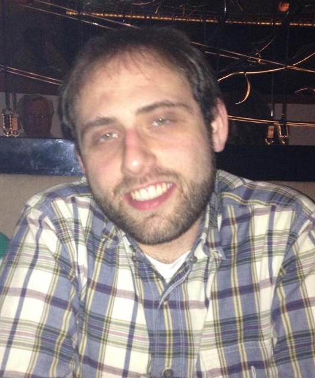

I am a PhD student studying data science at the University of Washington's [Information School (iSchool)](https://ischool.uw.edu/), finishing up my second year. My path to the iSchool was not a very direct one. I grew up in New York, and got my Bachelors degree in neuroscience from Brown University. After graduating, I moved to Seattle and started as a research assistant in a behavioral neuroscience lab at the University of Washington Medical Center, studying the roles of different brain pathways on itching. During this time, I contemplated and ultimately rejected a career in medicine or neuroscience research, and began looking around to figure out what else I was going to do. I knew that I loved scientific research, but I didn't know what domain I wanted to apply that passion to.

I started working as a database manager for Cornish College of the Arts, and began developing some skills working with structured data. It was at this time that I became aware of the emerging field of [Information Science](https://en.wikipedia.org/wiki/Information_science), an interdisciplinary field whose research encompasses, among other things, the potential held by the analysis, manipulation, and communication of data. Since starting the program, I have joined the [DataLab](https://datalab.ischool.uw.edu/), a subgroup in the iSchool centered around data-intensive research projects. My focus so far has been on projects analyzing and visualizing data related to [higher education](http://coursector.org/) and [networks of scholarly publication](http://cse512-15s.github.io/fp-jporteno-mraza/), with a focus on creating interactive visualizations using [D3](http://d3js.org/).

I have come a long way in a short time, having come from a place not very long ago of having almost no experience programming computers or working with large data sets, to having real-world experience with various techniques for data manipulation, analysis and visualization, and being proficient in fussy but powerful tools like [Python](https://www.python.org/), [R](http://www.r-project.org/), [Git](https://git-scm.com/), and [D3](http://d3js.org/). Coming to the DSSG program has been a vote of confidence for what I have been learning, as I've found that my skills are respected and that I actually have a lot to teach my fellow DSSG students. It is an amazing feeling to be able to help other data scientists troubleshoot problems and learn new skills, considering that it was less than two years ago that computers intimidated me and the term "algorithm" sounded completely foreign to me.

The social good aspect of the DSSG program is also really exciting to me, especially the community angle. By now I've racked up more than six years living in Seattle, and I've enjoyed volunteering with local non-profits like the [Washington Bus](http://washingtonbus.org/) and [WAGR](http://wagunresponsibility.org/). As I've developed my interest in data science, I've worked on projects with them that address the [digital divide](https://en.wikipedia.org/wiki/Digital_divide), the widening gap in the availability of things like data science and technical skills between those organizations with resources (such as tech companies and financial institutions) and those without (especially those in the nonprofit and government sectors). I've also spent time volunteering as a mentor to teach data science skills to beginners in my community through organizations like the [Community Data Science Workshops](http://wiki.communitydata.cc/Community_Data_Science_Workshops) and [Software Carpentry](https://software-carpentry.org/).

The DSSG program is a fantastic opportunity to further develop my skills and use them to work toward having a positive impact on my community. The [Bill and Melinda Gates Foundation](http://www.gatesfoundation.org/) have an extremely formidable presence in Seattle, and, although they are typically more associated with the work they do around the world on issues of global health, they have a [subgroup devoted entirely to improving the lives of families and children in their home state of Washington](http://www.gatesfoundation.org/What-We-Do/US-Program/Washington-State). Their [Homelessness and Family Stability](http://www.gatesfoundation.org/What-We-Do/US-Program/Washington-State/Homelessness-and-Family-Stability) project seeks to learn from data in King, Pierce, and Snohomish counties to dramatically reduce family homelessness. I am excited and honored to be a part of this effort.

The beginning of the DSSG program has already been a fantastic experience. Our project leads at the Gates Foundation, Anjana and Neil, have provided us with excellent support and worked closely with us to help us start tackling the problem, and my fellow DSSG data scientists (you've met them already! they are faster bloggers than I am!) are wonderful and quite talented. Although we have already encountered some challenges---who knew that solving homelessness would not be an easy task?---I feel very optimistic that we will be able to have some small but helpful impact by the end of this short program.
